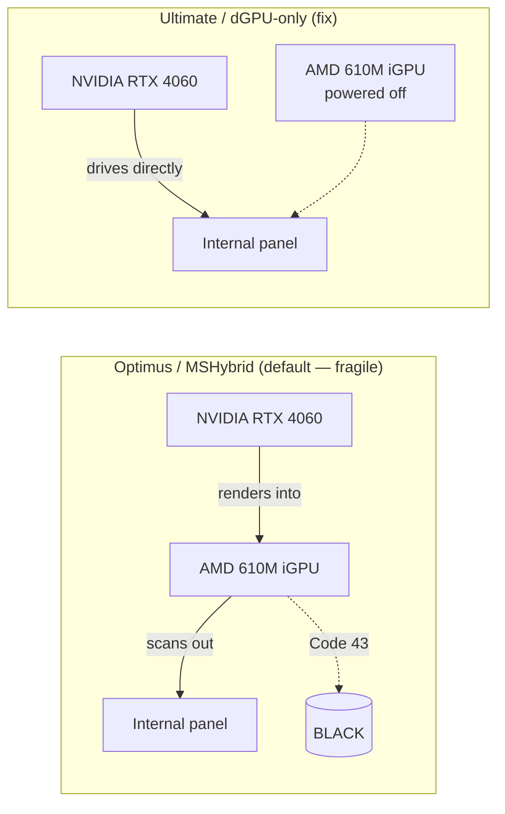

# ROG Display Recovery — AMD Radeon 610M "Code 43" Black Screen Fix

Recovery toolkit and automatic watchdog for **ASUS ROG laptops** where the
built‑in laptop screen goes **black** (or gets stuck at **640×480**) because the
**AMD Radeon 610M** integrated GPU fails with **Device Manager Error Code 43**.

> Developed and verified on an **ASUS ROG Strix G713PV** (AMD Ryzen 9 7845HX +
> AMD Radeon 610M iGPU + NVIDIA GeForce RTX 4060 Laptop dGPU, Windows 11). The
> approach applies to most ASUS ROG / TUF laptops that have a **hardware GPU MUX**
> and an AMD iGPU‑driven internal panel.

---

## TL;DR — the fix that actually works

If your ROG laptop's **internal screen is black but an external monitor works**,
and Device Manager shows the **AMD Radeon 610M with a yellow ⚠ / Code 43**:

1. **Switch the GPU MUX to "Ultimate" (dGPU‑only).** This re‑routes the laptop
   panel directly to the NVIDIA GPU and powers the broken AMD iGPU off, so its
   Code 43 can no longer black out your screen.
   - **Armoury Crate → GPU Mode → Ultimate**, *or* run [`Set-GpuMux.ps1`](Set-GpuMux.ps1).
2. **Do a full COLD shutdown** — hold the power button ~10s until it powers off,
   then press power again. A *warm* Restart leaves the MUX half‑applied (both
   screens black). A cold boot also clears the AMD Code 43.
3. If the panel comes up **stuck at 640×480**, force native resolution with
   [`Force-Resolution.ps1`](Force-Resolution.ps1) — no reboot needed.

That's it. The rest of this repo automates detection + recovery so you don't
have to remember any of it.

---

## Why this happens

On these laptops, in the default **MSHybrid / Optimus** GPU mode the **internal
panel is physically wired to the AMD Radeon 610M iGPU**. The NVIDIA dGPU renders
frames but copies them into the AMD's framebuffer for scan‑out. So when the AMD
iGPU drops into **Code 43** (commonly after sleep/resume), the panel goes dark
and the NVIDIA GPU *cannot* drive it — even though the NVIDIA card is perfectly
healthy and any external monitor keeps working.

Software GPU resets (including **Win + Ctrl + Shift + B**) generally **do not**
clear Code 43. What reliably works is:

- **Re‑routing the panel to the NVIDIA dGPU via the hardware MUX** ("Ultimate"
  mode) so the broken iGPU is out of the display path entirely, and/or
- **A full cold power cycle**, which re‑initialises the iGPU/MUX.



---

## What's in this repo

| Script | What it does |
|--------|--------------|
| [`Recover-Display.ps1`](Recover-Display.ps1) | **The recovery engine.** Runs an escalating, self‑stopping ladder: force native resolution → GPU stack reset → driver rescan / service restart → AMD iGPU power‑cycle → DisplaySwitch mode‑set → re‑apply known‑good registry → (last resort) reboot ladder with loop protection. Re‑checks panel health after every step and **exits the instant the panel is usable**. |
| [`Install-AutoRecovery.ps1`](Install-AutoRecovery.ps1) | Registers a single scheduled task (`Display_AutoRecover_ROG`) that runs the engine at **logon / wake / unlock**, elevated, in the interactive session. Removes older/duplicate tasks. Run once, as admin. |
| [`Set-GpuMux.ps1`](Set-GpuMux.ps1) | Flips the **hardware GPU MUX** between **Ultimate** (panel → NVIDIA) and **Optimus** (panel → AMD) via the ASUS ATK WMI interface. Read‑before‑write, reversible, optional auto‑reboot. |
| [`Force-Resolution.ps1`](Force-Resolution.ps1) | Forces the internal panel back to its **native resolution** (fixes the 640×480 stuck state). Non‑destructive, no reboot. |
| [`Check-StateAfter.ps1`](Check-StateAfter.ps1) | One‑shot health probe: GPU status/Code, MUX mode, active monitors, resolution. |
| [`RECOVERY.md`](RECOVERY.md) | Full human playbook: symptoms, fast path, permanent fix, and how the automation is wired. |

There are additional diagnostic/scan scripts (`scan_*.ps1`, `run_diagnostics.ps1`,
`generate_report.ps1`, hardening helpers) used during investigation.

> **Note:** the recovery engine reads/writes the **ASUS ATK WMI** interface
> (`root\wmi:AsusAtkWmi_WMNB`). MUX device id `0x00090016`; `DSTS` reads,
> `DEVS(Device_ID, Control_status)` writes (`0` = Ultimate, `1` = Optimus). These
> calls require administrator rights and an ASUS ROG/TUF firmware that exposes the
> MUX.

---

## Quick start

```powershell
# 1. Check current state (no changes)
.\Check-StateAfter.ps1

# 2. (Optional) Switch the panel to the NVIDIA GPU permanently, then cold-boot
.\Set-GpuMux.ps1 -Mode Ultimate

# 3. Install the automatic watchdog (run as admin)
.\Install-AutoRecovery.ps1

# Manual recovery without rebooting (safe mid-session):
.\Recover-Display.ps1 -NoReboot
```

If a script is blocked by execution policy, launch it with:
`powershell -NoProfile -ExecutionPolicy Bypass -File .\Recover-Display.ps1`

---

## Tips that prevent the problem

- **Run in "Ultimate" GPU mode** so the AMD iGPU is never in the display path.
- **Disable Windows Fast Startup** (`HiberbootEnabled = 0`) so every boot is a
  clean cold init and the MUX/driver state can't carry over half‑applied.
- **Plug external monitors in *after* Windows loads**, not at boot — connecting
  one at boot can break the POST display handoff on some firmwares.
- If the panel is ever fully black: **hold power 10s → off → power on** (cold
  boot), not Restart.

---

## Credits & related tools

- **[G‑Helper](https://github.com/seerge/g-helper)** by *seerge* — an excellent
  open‑source ASUS control app that can also toggle the GPU MUX. Recommended if
  you'd rather not use Armoury Crate.
- MUX control here uses the ASUS ATK WMI interface that ASUS' own software exposes.

## Disclaimer

These scripts change GPU mode, display resolution, power settings and (as a last
resort) reboot the machine. They are provided **as is**, without warranty (see
[`LICENSE`](LICENSE)). Review the code before running. Use at your own risk.

---

**Keywords:** ASUS ROG Strix G713PV · AMD Radeon 610M · Code 43 · black screen ·
laptop display not working · MSHybrid · Optimus · Ultimate GPU mode · hardware
MUX · NVIDIA RTX 4060 Laptop · iGPU disabled · 640x480 stuck resolution ·
Win+Ctrl+Shift+B · Armoury Crate GPU Mode · display recovery · Windows 11.
